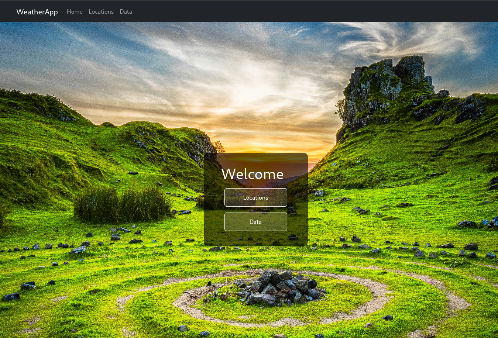
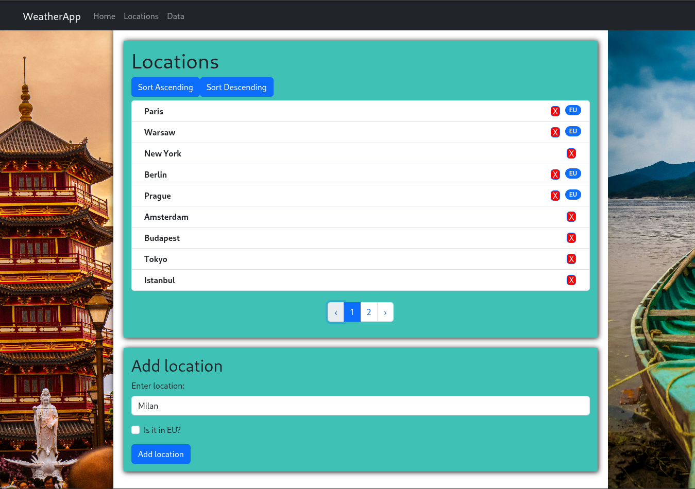
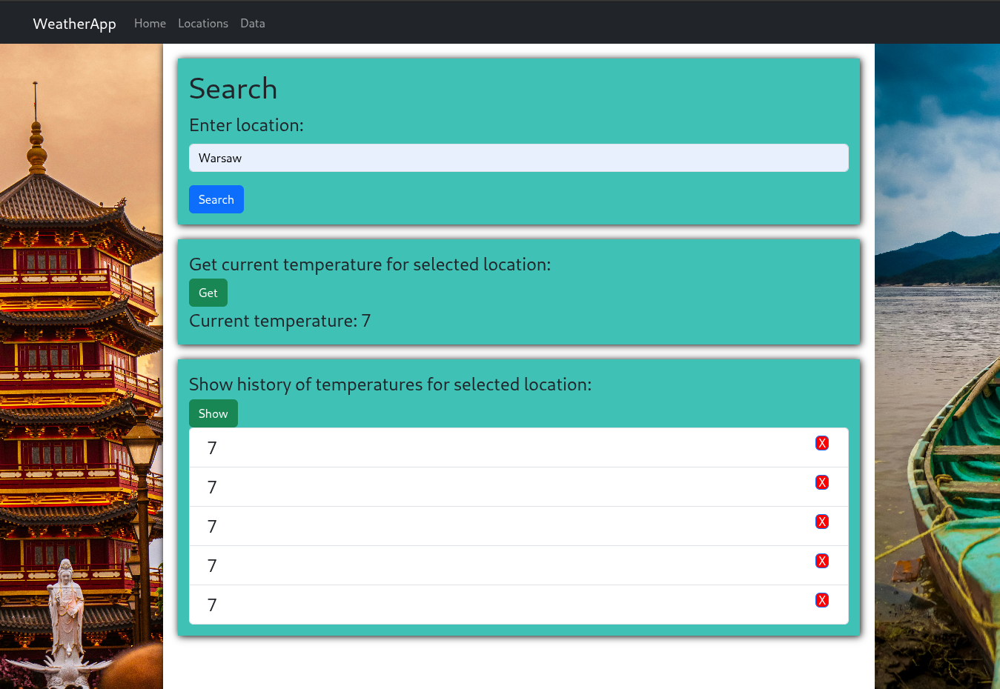

# Essato-Internship-Task

This is recruitment task for Essato Company.

## Required technologies:
npm\
Nodejs\
Java 21\
Docker

## Run:
In order to open application you have to run three things:\
1. frontend:\
Go to frontend catalog and type:
> npm install\
> npm start
2. backend:\
To run project You can use IDEA environment\
or use maven:\
inside backend directory run (for Windows):\
to start backend\
>.\mvnw spring-boot:run\
to build:\
>.\mvnw compile\
to clean project:\
>.\mvnw clean

3. database:\
Database is placed inside docker container.\
It should be available together with running springboot app.

## Result
Website consists of three pages:
1. Home page:

It navigates in all app.
2. Locations Page:

Here we can create locations and see already created.
3. Data Page:

Here we can fetch temperatures from website: https://weatherstack.com/
and add it to database.